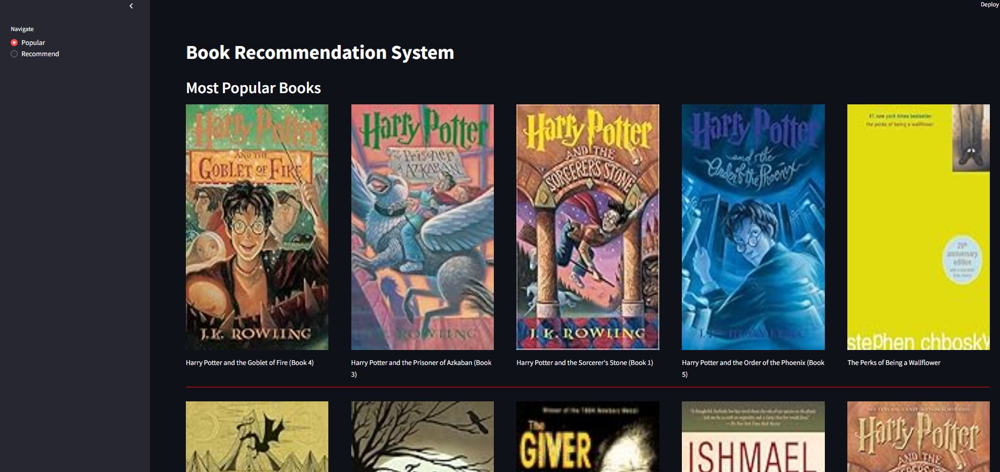

# 📚 Collaborative-Based Book Recommender System

This is a **Collaborative Filtering-based Book Recommendation System** where:

- The **frontend** is built using **Streamlit**
- The **backend** is powered by **Flask**
- The two are connected using **CORS**

---

## 🚀 Features

1. **Top Rated Books Page** 📖  
   Displays the most popular books based on average user ratings.

2. **Book Recommendation Page** 🔍  
   Select a book, and it shows **5 similar books** using **collaborative filtering** based on user ratings.

---

## 🧠 How It Works

- We created a **pivot table**: Users × Books with their respective ratings.
- This pivot table is used as an **embedding matrix**.
- Using **cosine similarity**, we compute the similarity between books.
- Based on this similarity, we return the top 5 recommendations for any selected book.

---

## 🛠️ Tech Stack

- **Frontend**: Streamlit (Python)
- **Backend**: Flask (Python)
- **Machine Learning**: Collaborative Filtering using Cosine Similarity
- **Interfacing**: CORS (Flask-CORS)

---

## Screenshots

### Homepage



### Results


## ⭐ Star the Repository

If you find this project useful, please consider giving it a star! Your support helps the project grow and reach more people.

## Prerequisites

- Python 3.13
- Flask 3.1.1
- Streamlit 1.45.1
- Other dependencies listed in `pyproject.toml`

## Installation

### Local Installation

1. Clone the repository:

```bash
git clone https://github.com/rishabhpancholi/collaborative-book-recommender.git

```

2. Create and Activate your virtual environments in both server and client directories:

```bash

python -m venv venv
venv\Scripts\activate

```

2. Install dependencies using pip:

```bash
pip install -r requirements.txt
```

Or if you want to install in development mode:

```bash
pip install -e .

```

3. Run client and server side code seperately:

```bash
streamlit run app.py --server port [port-number]
python app.py

```

4. Open your browser and navigate to `http://localhost:[port-number]`

## Contributing

Contributions are welcome! Please feel free to submit a Pull Request.

## License

This project is licensed under the MIT License - see the LICENSE file for details.
